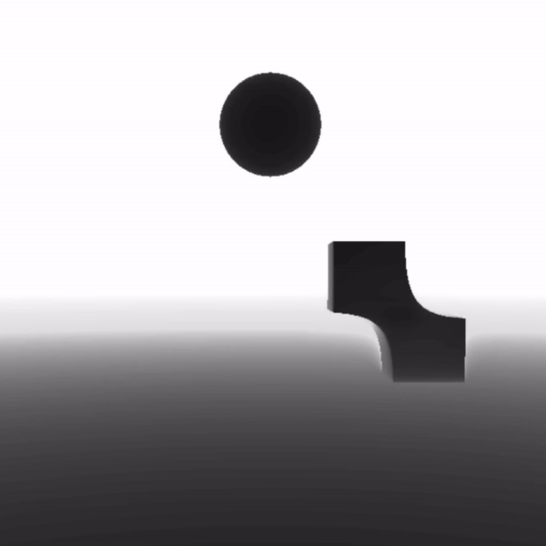

# RayMarching

Welcome to the beautiful world of sphere tracing.

## How does raymarching work in the context of rendering?

In raytracing you shoot a ray into the scene from the camera pov and calculate the intersection point of a ray. In sphere tracing you still shoot a ray from the camera, but you calculate the distance from the current point (initially the camera) to the closest object. Once you know the minimum distance to the closest object you know that you can travel along the ray to that minimum distance and get a new current point. And you repeat these steps until the minimum distance to the closest object is smaller than an arbitrary value (0.001) and you know you have hit something.

## My implementations

### Smooth blending

Here you'll find my first attempt figuring some basic formula's out. It uses the signed distance formula's for a sphere, a cube, and a plane.
It might look like all objects are lit and use normals, but it actually cleverly remaps the value of how far the ray travelled in the scene to a black and white colour.
When the shpere or cube overlaps with the plane it takes whatever is closest. However when they overlap with eachother a smooth minimum of the objects is taken. Resulting in this cool slimey effect.

### Fractals

This second frame is me exploring something similar to instanced rendering. There is but one cube in this scene.
When calculating the distance to this cube we pass along the point in space where the raymarcher is querying from. By remapping this point in the zero to one space, we can hit the same cube at different distances in space.
As the ray travels further into the scene a stronger rotation is applied to it.
The scene is now also coloured but it is still using a remap formula based on distance (Inigo Quilez).

### MandelBulb

For the final frame I present to you the MandelBulb, a manifestation of the Mandelbrot set.
If you had a super computer and a crazy amount of GPU-power you can keep zooming in and keep discovering more detail.
To visualize this shape I needed some form of ambient occlusion, otherwise you can't really see the detail. To achieve this in a cheap manner, I used the number of steps the ray had to take to hit a point.
After updating one of the values in the complex sdf, it resulted in this cool animated MandelBulb.
